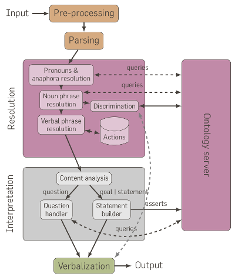

Dialogs: A Naive Natural Language Processing
============================================

(c) LAAS-CNRS 2010-2013, EPFL 2013-2015

This module, licensed under the permissive BSD 3-clause, reads on stdin user
input in natural language, parse it, call resolution routines when ambiguous
concepts are used, and finally generate RDF statements that are an
interpretation of the input.

It includes as well a verbalization module that conversely turns RDF statements
into a sentence in natural language.





While not strictly required, it is strongly recommanded to use `dialogs` with a
knowledge base that follows the ''KB API'' like
[minimalKB](https://github.com/severin-lemaignan/minimalkb/) or
[oro-server](http://oro.openrobots.org).

You are welcome to reuse this software for your research. Please refer to the
CITATION file for proper attribution in scientific works.

Installation
------------

Simply run:

```
> pip install dialogs
```

Usage
-----

You can start to use `dialogs` immediately. For instance, try:

```
> dialogs -d -p"What are you doing?"
> dialogs -d -p"I'm playing with you"
```

The `-d` flags activates the debug mode, and gives you a complete picture of the
different steps: pre-processing, parsing, semantic resolution of the atoms of
the sentence, interpretation and verbalization ([read the
paper](http://academia.skadge.org/publis/lemaignan2011grounding.pdf) to know
more about these steps).

Lines displayed in cyan log the interactions of the dialogue module with
the knowledge base (queries and knowledge revisions). If no knowledge base is
running, most of the semantic resolution attempts will fail, so when asked "what
are you doing?", the system answers "I don't know".

If you start `dialogs` with no options, it will simply read on stdin.

Check ``dialogs --help`` for other options.

Common invokation is:

```
> dialogs -d NAME_OF_THE_SPEAKER
```

The main test-suite can be started with:

```
> dialogs_test
```

Demo
----

A live demo of the *parser alone* (not the semantic grounding part) is
[available online](https://chili-research.epfl.ch/dialogs/).

